# Android AI 应用开发面经（2026版）

> 面向 Android + LLM / RAG / Agent 方向岗位。每题含「回答要点」「追问」「加分项」，便于背诵和临场展开。

### 图表怎么看？

下文流程图使用 **Mermaid** 语法，推荐打开方式：

| 工具 | 支持 |
|------|------|
| VS Code + Markdown Preview | ✅ 原生支持 |
| GitHub / GitLab | ✅ 原生支持 |
| Typora / Obsidian / 语雀 | ✅ 多数支持 |
| 微信 / 纯记事本 | ❌ 可复制代码到 [Mermaid Live Editor](https://mermaid.live) 预览 |

面试白板时，把下面几张图画熟即可：**接入架构图、RAG 链路、流式数据流、Function Calling 时序、系统设计总图**。

---

## 一、自我介绍模板

### 30秒版本

我目前主要从事 Android 客户端开发，拥有 AI 应用落地经验，熟悉大模型接入、流式输出、RAG、函数调用以及端侧 AI 部署。在项目中负责 AI 聊天、智能助手、内容生成等功能开发，重点关注性能优化、稳定性和用户体验。

### 1分钟版本（带项目）

我在 Android 方向有 X 年经验，近期主要做 **AI 应用工程化落地**。在 XX 项目中，我负责 AI 聊天模块：用 **SSE 实现流式输出**，配合 **StateFlow + Compose** 做 UI 刷新；接入 **Function Calling** 实现查天气、查订单等工具调用；用 **RAG** 解决企业知识库问答。优化上把 **首 Token 延迟（TTFT）降低约 60%**，通过上下文裁剪和 Prompt 压缩把 **Token 成本降低约 40%**。我对 LLM 原理、RAG 链路、端云协同和 Android 性能优化都比较熟悉，希望继续在 AI + 移动端方向深耕。

### 自我介绍注意点

- 先说 **Android 功底**，再说 **AI 落地**，避免只讲概念不讲工程
- 每个亮点尽量带 **数字**（延迟、成本、Crash 率）
- 结尾表达方向契合，不要背简历流水账

---

## 二、高频面试题（含参考答案）

### 1. Android 如何接入大模型？

#### 回答要点

**三种主流接入方式：**

| 方式 | 适用场景 | Android 实现 |
|------|----------|--------------|
| REST API（一次性返回） | 短文本、非实时 | OkHttp + Retrofit |
| SSE 流式 | AI 聊天、打字机效果 | OkHttp EventSource / 自研 SSE 解析 |
| WebSocket | 双向实时、语音对话 | OkHttp WebSocket |

**推荐架构：**

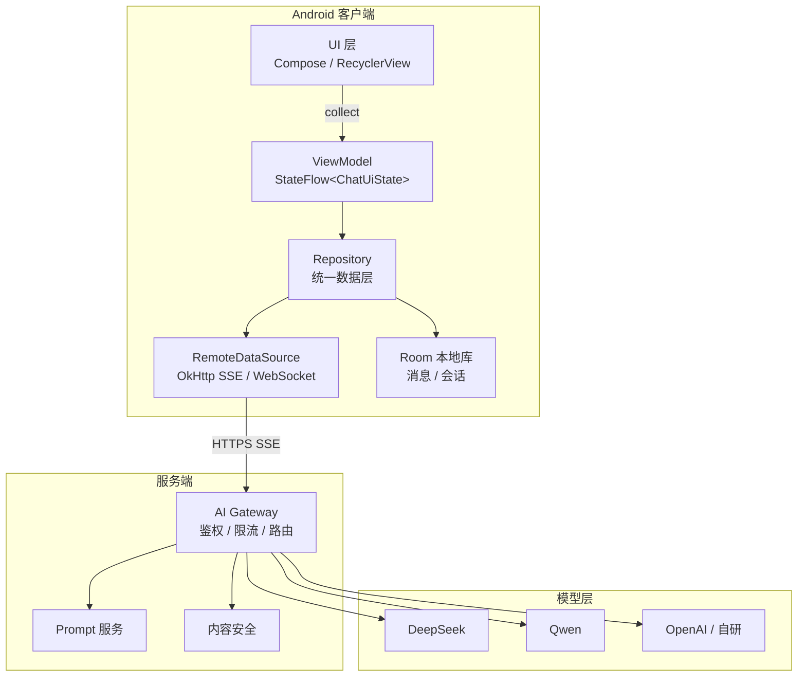

**三种接入方式对比：**

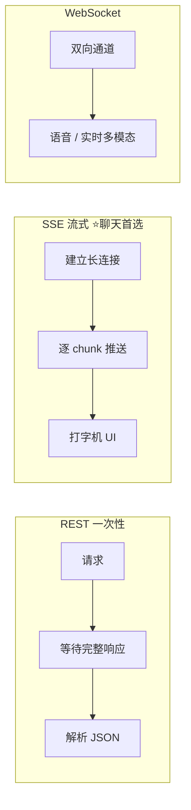

**工程化必做：**

1. **统一 AI Gateway**：客户端不直连多家模型，由后端做路由、鉴权、限流
2. **请求封装**：model、temperature、max_tokens、stream、tools（Function Calling）
3. **Structured Output**：用 JSON Schema 约束模型输出，便于解析（如 `response_format: json_object`）
4. **取消与超时**：`Job.cancel()` + OkHttp `Call.cancel()`，避免用户切页后仍消耗 Token
5. **重试策略**：网络错误指数退避；429 限流等待；业务错误不重试
6. **Token 统计**：请求前后记录 usage，本地累加做成本看板

#### 常见追问

- **为什么聊天用 SSE 而不是普通 HTTP？** SSE 单向流式，协议简单、防火墙友好；WebSocket 适合双向（语音、多模态实时）
- **客户端要不要直连 OpenAI？** 生产不建议：密钥泄露、无法统一计费审计、难做内容安全过滤
- **如何做模型降级？** Gateway 层：主模型超时 → 切小模型；或按会员等级路由

#### 加分项

- 支持多模型切换（DeepSeek / Qwen / Gemini）且 UI 无感
- 离线队列：弱网时消息本地排队，恢复后重发
- 请求去重：相同 Prompt 短时间去重（Cache）

---

### 2. 什么是 RAG？完整链路怎么讲？

#### 回答要点

**RAG（Retrieval Augmented Generation）= 检索增强生成**

核心思想：不把所有知识塞进模型参数，而是 **检索相关文档片段**，拼进 Prompt 让模型「带着资料回答」。

**完整链路：**

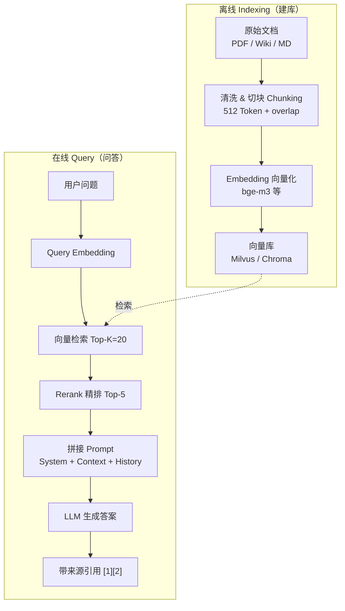

**Hybrid Search（加分项）：**

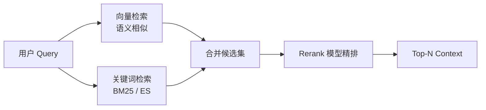

**Chunk 策略（常考）：**

- 按段落 / 固定 Token 数（如 512）切块
- 加 overlap（如 50 Token）避免语义截断
- 元数据打标：来源 URL、更新时间、权限域

**优势：**

- 知识可实时更新（改文档即可，无需重训）
- 降低幻觉（有依据可引用）
- 适合企业私域知识、长文档问答

**劣势与应对：**

- 检索质量决定上限 → Rerank + Hybrid Search（向量 + 关键词）
- 延迟增加 → 缓存热门 Query、异步预检索
- Chunk 切不好会丢上下文 → 调 chunk size 和 overlap

#### 常见追问

- **Embedding 模型怎么选？** 中文场景常用 bge-m3、text-embedding-3-small；要和向量库维度匹配
- **向量检索慢怎么办？** HNSW 索引、分片、热点缓存；Android 端一般不跑向量库，走服务端
- **RAG 和 Fine-tuning 怎么选？** RAG 适合知识更新频繁、可解释；Fine-tuning 适合固定风格/格式、领域术语

---

### 3. Android 如何实现流式聊天？

#### 回答要点

**数据流：**

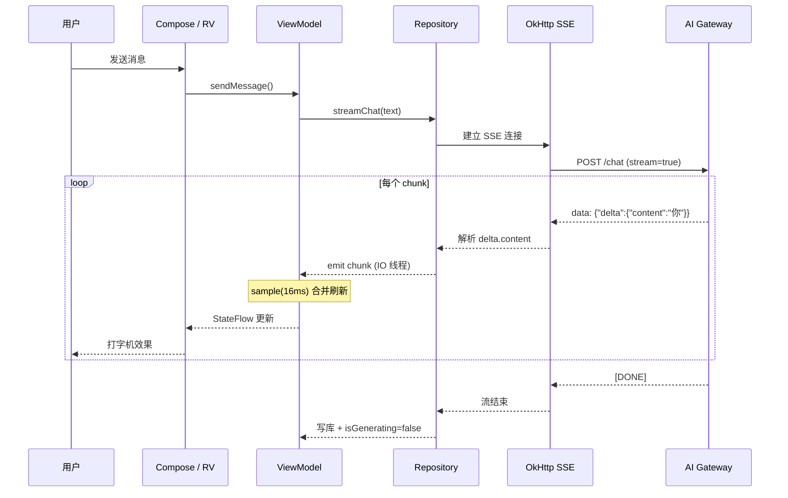

**防卡顿分层优化：**

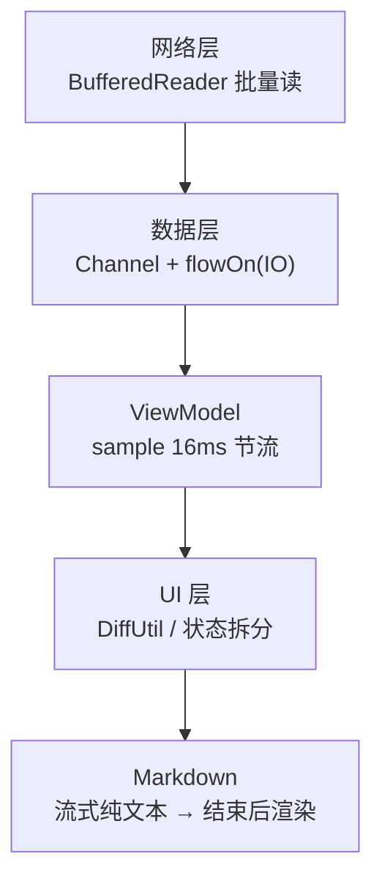

**ViewModel 示例逻辑：**

```kotlin
// 伪代码示意
fun sendMessage(text: String) {
    viewModelScope.launch {
        _uiState.update { it.copy(isGenerating = true) }
        val messageId = insertLocalMessage(role = USER, content = text)
        val assistantId = insertLocalMessage(role = ASSISTANT, content = "")
        aiRepository.streamChat(text)
            .catch { e -> handleError(e) }
            .collect { chunk ->
                appendContent(assistantId, chunk)  // 追加而非全量替换
            }
        _uiState.update { it.copy(isGenerating = false) }
    }
}
```

**UI 层优化（防卡顿）：**

| 问题 | 方案 |
|------|------|
| 每个 token 刷新整列表 | **16ms 批量刷新**（`debounce` / `sample`） |
| Markdown 重复解析 | **增量解析** 或流结束后再完整渲染 |
| RecyclerView 抖动 | `DiffUtil` + `payload` 局部更新 |
| Compose 重组过多 | 状态拆分：`messages` 与 `generatingText` 分离 |
| 长列表内存 | `Paging3` + 消息分页加载 |

#### 常见追问

- **切后台时流式请求怎么处理？** `onStop` 可选 cancel 或继续；继续则需 WorkManager 兜底写库
- **用户快速连发多条怎么办？** 队列化：前一条未完成时禁用发送或排队
- **如何实现「停止生成」？** cancel Coroutine Job + cancel OkHttp Call，UI 保留已生成部分

---

### 4. AI 应用如何控制成本？

#### 回答要点

**成本 = Token 数 × 单价**，优化从「少发、少算、缓存」三方面入手。

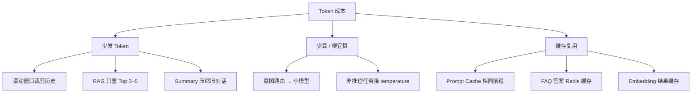

**Prompt 层：**

- System Prompt 精简，去掉废话
- 历史对话 **滑动窗口**（只保留最近 N 轮）
- **Summary Memory**：旧对话压缩成摘要再带入
- RAG Context 只塞 Top 3~5 条，不要塞满

**模型层：**

- 简单任务用小模型（路由：意图分类 → 选模型）
- 非流式短回答用便宜模型，复杂推理用大模型

**缓存层：**

- **Prompt Cache**（OpenAI/Claude 支持）：相同前缀复用
- 相同 FAQ 答案本地/Redis 缓存
- Embedding 结果缓存

**工程层：**

- 限流：单用户 QPS、日 Token 上限
- 埋点：按功能/用户统计 Token，驱动产品决策
- 客户端预检：超长输入截断 + 提示

#### 常见追问

- **上下文 128K 是不是可以全塞？** 可以塞但贵且慢，且中间信息易被「Lost in the Middle」忽略
- **怎么算一笔对话多少钱？** `(input_tokens × 输入单价 + output_tokens × 输出单价) / 1M`

---

### 5. 如何处理幻觉（Hallucination）？

#### 回答要点

幻觉 = 模型生成看似合理但 **事实错误或无依据** 的内容。

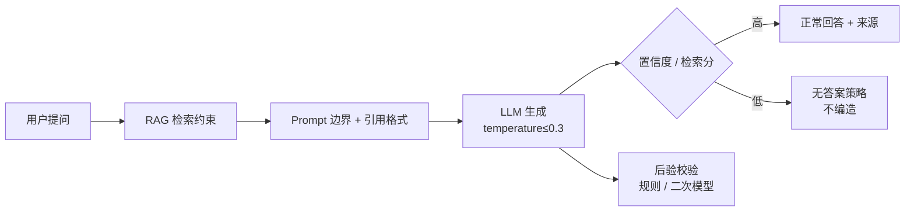

**工程手段：**

1. **RAG**：用检索内容约束回答范围
2. **来源引用**：要求模型标注 `[1][2]`，UI 展示原文跳转
3. **Structured Output**：强制 JSON 格式 `{"answer":"","confidence":0.8,"sources":[]}`
4. **置信度门控**：低置信度时回复「不确定，建议查阅…」
5. **无答案策略**：检索分数低于阈值时，明确说「知识库中未找到」，禁止编造
6. **后验校验**：关键数字/日期用规则或二次模型校验
7. **Temperature 调低**：事实问答用 0~0.3

#### 常见追问

- **RAG 了还会幻觉吗？** 会，模型可能「曲解」检索内容，需要 citation + 低 temperature
- **怎么评估幻觉率？** 人工标注 + 自动化：答案与 source 做 entailment 检测

---

### 6. Function Calling / Tool Use 原理与 Android 实现

#### 回答要点

**流程：**

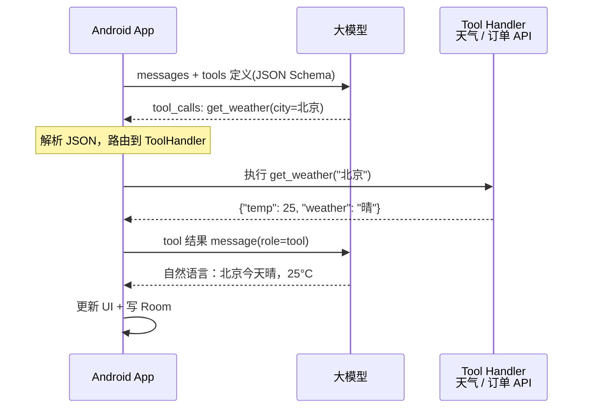

**Android Tool 注册架构：**

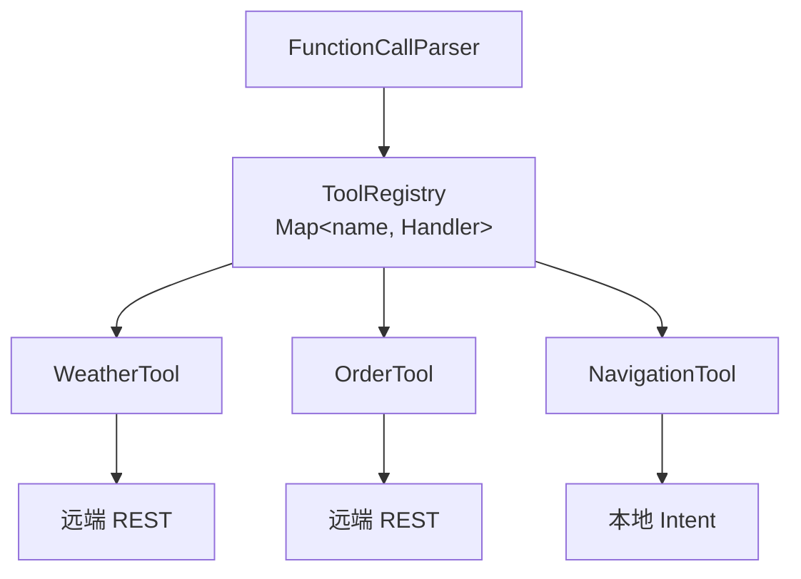

**模型输出示例：**

```json
{
  "tool_calls": [{
    "id": "call_abc",
    "type": "function",
    "function": {
      "name": "get_weather",
      "arguments": "{\"city\":\"北京\"}"
    }
  }]
}
```

**Android 实现要点：**

- 用 **策略模式** 注册 Tool：`Map<String, ToolHandler>`
- 参数校验用 JSON Schema / kotlinx.serialization
- 敏感 Tool（支付、删数据）加 **二次确认**
- 工具执行放 **IO 线程**，结果回主线程更新 UI

#### 常见追问

- **和 MCP 什么关系？** Function Calling 是模型能力；MCP 是工具连接的标准协议，可对接 IDE、浏览器、知识库
- **模型选错工具怎么办？** 优化 tool 描述、加 few-shot、意图分类前置

---

### 7. Prompt 如何设计？（高频追问）

#### 回答要点

**推荐结构：**

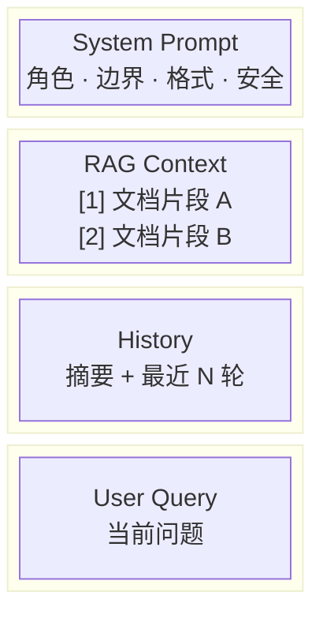

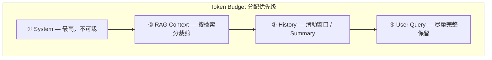

**System Prompt 模板要素：**

- 你是谁、能做什么、不能做什么
- 回答格式（Markdown / JSON / 是否带引用）
- 无答案时怎么说
- 语言、长度限制

**技巧：**

- **Few-shot**：给 1~2 个标准问答示例
- **CoT**：复杂推理加「请一步步思考」（注意成本）
- **分隔符**：用 `###` 或 XML 标签区分各段，减少混淆

#### 常见追问

- **Prompt 放客户端还是服务端？** 核心 System Prompt 放服务端，防泄露、便于热更新
- **多语言怎么处理？** System 里指定输出语言，或按用户 locale 动态注入

---

### 8. Context（上下文）如何管理？

#### 回答要点

| 策略 | 说明 | 适用 |
|------|------|------|
| Sliding Window | 只保留最近 K 轮 | 通用聊天 |
| Summary Memory | 旧对话 LLM 压缩成摘要 | 长会话 |
| Fact Memory | 结构化存储用户偏好/事实 | 个性化助手 |
| Token Budget | 按优先级分配：System > RAG > History > User | 成本敏感 |

**上下文管理策略图：**

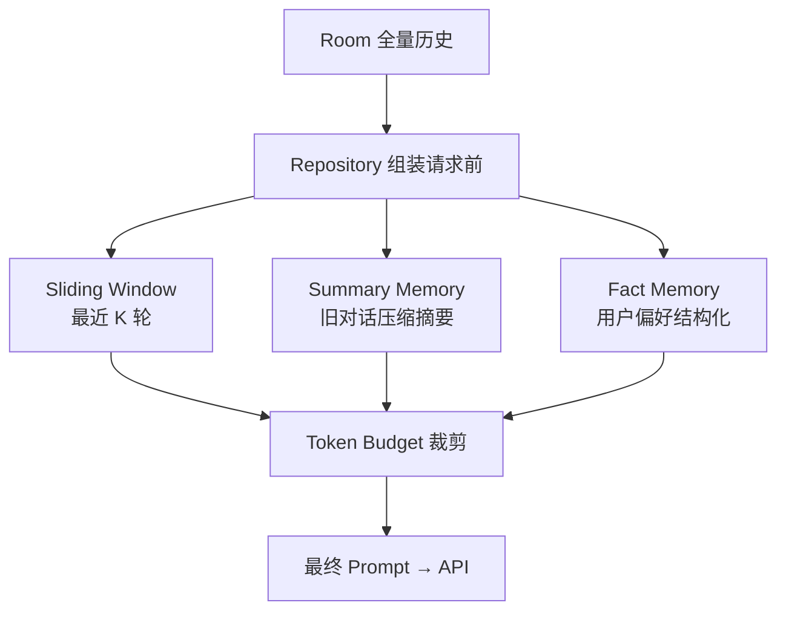

**Android 侧：**

- Room 存全量历史，发请求前在 Repository **裁剪组装**
- 摘要可异步在后台线程生成，存 `summary` 字段
- 单会话 Token 计数，接近上限 UI 提示「开启新对话」

---

### 9. AI 聊天记录如何存储？

#### 回答要点

**推荐：Room + Paging3**

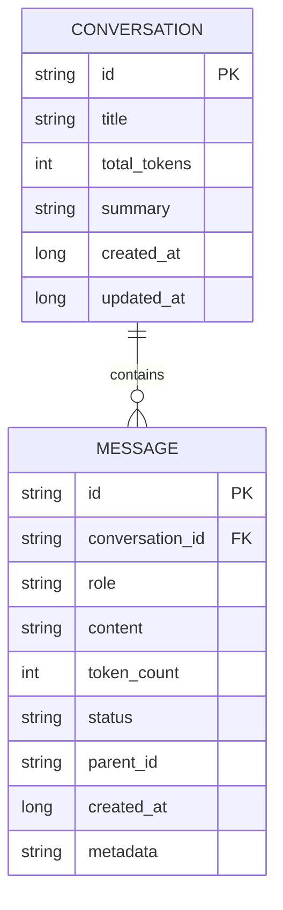

**消息状态流转：**

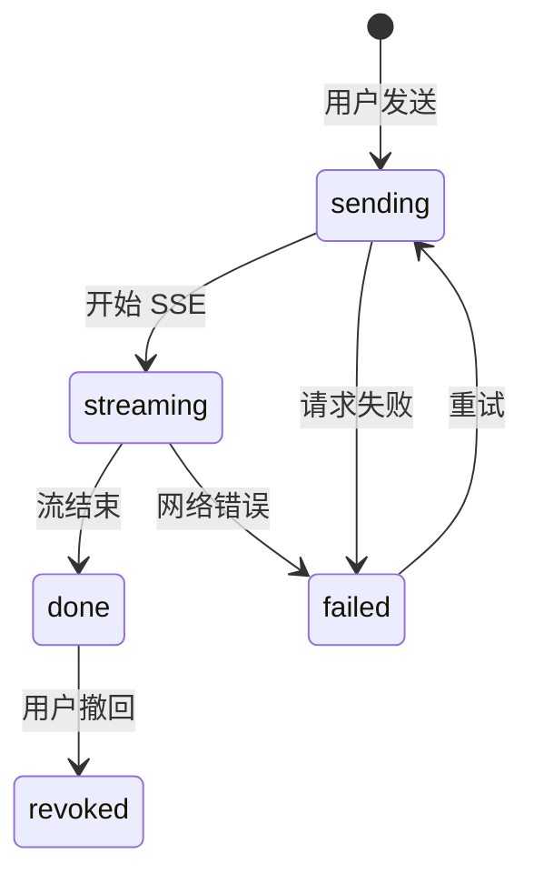

| 字段 | 说明 |
|------|------|
| id | 主键 |
| conversation_id | 会话 ID |
| message_id | 服务端/本地消息 ID |
| role | user / assistant / system / tool |
| content | 文本内容 |
| token_count | 本条 Token |
| status | sending / streaming / done / failed / revoked |
| parent_id | 分支对话、重新生成时关联 |
| created_at | 时间戳 |
| metadata | JSON：来源引用、tool_calls 等 |

**注意：**

- 流式过程中 **节流写库**（如每 500ms 或结束时一次）
- 敏感内容加密存储（EncryptedSharedPreferences / SQLCipher）
- 同步策略：本地优先展示，服务端对账

---

### 10. 流式输出卡顿如何解决？（Android 专项）

#### 回答要点

| 层级 | 方案 |
|------|------|
| 网络 | SSE 解析用 BufferedReader，避免 per-byte 处理 |
| 数据层 | Channel 缓冲 + `flowOn(Dispatchers.IO)` |
| ViewModel | `sample(16)` 或 `debounce(16)` 合并刷新 |
| 字符串 | `StringBuilder` 追加，避免每次 `+` 拼接 |
| RecyclerView | DiffUtil + payload 只更新最后一项 content |
| Compose | `derivedStateOf`、消息项独立 `remember`、避免整列表重组 |
| Markdown | 流式时用纯文本，结束后再 Markwon/Lazy 渲染 |
| 主线程 | 解析、拼串在 IO，仅 UI 状态更新在主线程 |

---

### 11. 端侧 AI（On-Device LLM）了解吗？

#### 回答要点

**场景：** 离线翻译、端侧摘要、隐私敏感、降低云端成本。

**Android 方案：**

- **Google ML Kit / Gemini Nano**（部分设备）
- **llama.cpp + JNI** 跑量化模型（GGUF Q4）
- **MediaPipe LLM Inference API**
- **ONNX Runtime** 跑小模型

**权衡：**

- 优点：低延迟、隐私、无网可用
- 缺点：模型能力弱、包体积大、耗电、机型适配难

**混合架构：** 简单任务端侧，复杂任务云端，Router 自动选择。

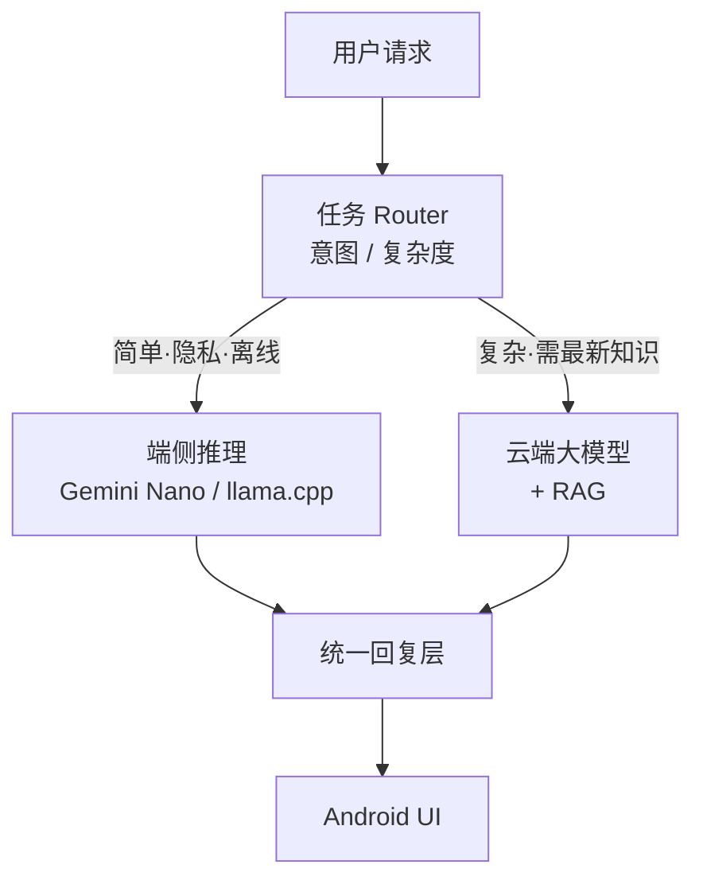

---

### 12. AI 安全与合规（ increasingly 常考）

#### 回答要点

- **输入过滤**：Prompt Injection 检测、敏感词、长度限制
- **输出过滤**：内容安全 API、政治/暴力过滤
- **数据合规**：用户数据不上云选项、隐私协议、GDPR/个保法
- **密钥安全**：API Key 放服务端，客户端用短期 Token
- **审计日志**：谁问了什么（脱敏后）便于追溯

---

## 三、系统设计题

### 设计一个 AI Chat App（标准答题框架）

#### 1. 需求澄清（先问 2 分钟）

- 用户规模？是否多模态（图/语音）？
- 是否企业版（权限、知识库隔离）？
- SLA：TTFT、可用性目标？

#### 2. 模块划分

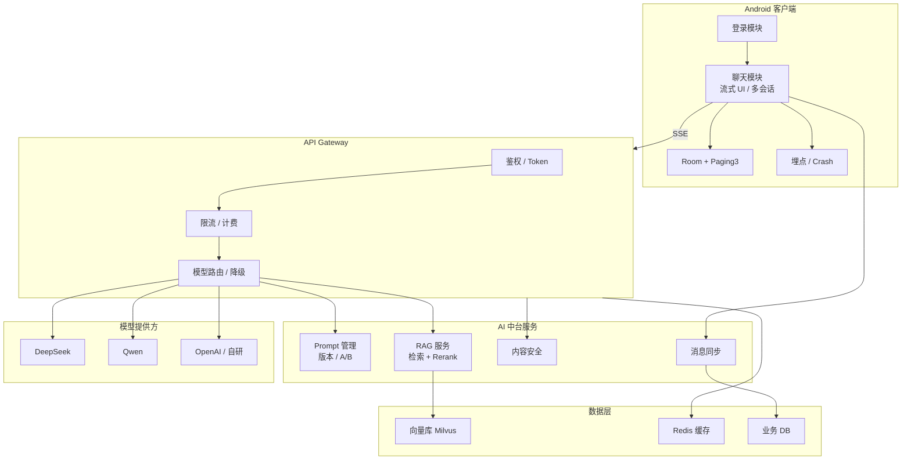

| 模块 | 职责 |
|------|------|
| 登录系统 | OAuth / 手机号，Token 刷新 |
| 聊天模块 | 流式 UI、多会话、停止生成 |
| AI 网关 | 模型路由、流式转发、降级 |
| Prompt 管理 | 版本化、A/B、热更新 |
| RAG 系统 | 文档 ingest、检索、Rerank |
| 消息存储 | 本地 Room + 云端同步 |
| 埋点分析 | TTFT、TPS、Token、留存 |

#### 3. 核心指标

| 指标 | 含义 | 优化方向 |
|------|------|----------|
| TTFT | 首 Token 时间 | 模型选型、预热、边缘节点 |
| TPS | 每秒生成 Token 数 | 流式、模型推理优化 |
| Token 成本 | 单次对话费用 | 上下文裁剪、小模型路由 |
| Crash 率 | 稳定性 | 流式异常兜底、超时 cancel |
| 幻觉率 | 答案准确率 | RAG + 引用 + 评测 |

#### 4. 扩展讨论

- **多设备同步**：消息云端存储 + 增量同步
- **分支对话**：message 树结构，parent_id 关联
- **限流熔断**：用户级 QPS，模型故障切备用

---

### 设计 RAG 知识库问答系统

**要点：** 文档上传 → 解析（PDF/MD）→ Chunk → Embed → 入库；问答时 Hybrid Search + Rerank；权限过滤（用户只能搜有权限的文档）；答案带来源卡片。

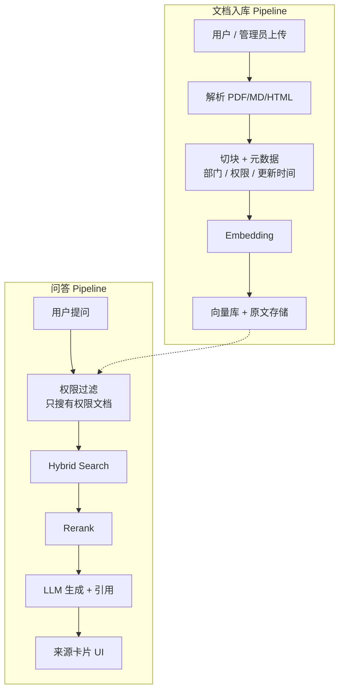

---

## 四、项目亮点模板（STAR）

### AI 聊天助手

**S（背景）：** 产品需要 App 内 AI 助手，支持企业知识问答和工具调用。

**T（任务）：** 负责 Android 端聊天模块与 AI 接入全链路。

**A（行动）：**

- SSE 流式 + StateFlow 架构，16ms 批量刷新解决卡顿
- Markwon 增量 Markdown，流结束后再渲染代码块
- Function Calling 接入天气、订单查询
- RAG 对接企业 Wiki，答案展示来源链接
- 上下文滑动窗口 + Summary 降低 Token

**R（结果）：**

- TTFT 从 ~2s 降至 ~0.8s（模型预热 + 网关优化）
- 单次对话 Token 降低约 40%
- 聊天相关 Crash 下降约 30%

---

## 五、面试官最爱追问（速记）

### SSE vs WebSocket vs REST

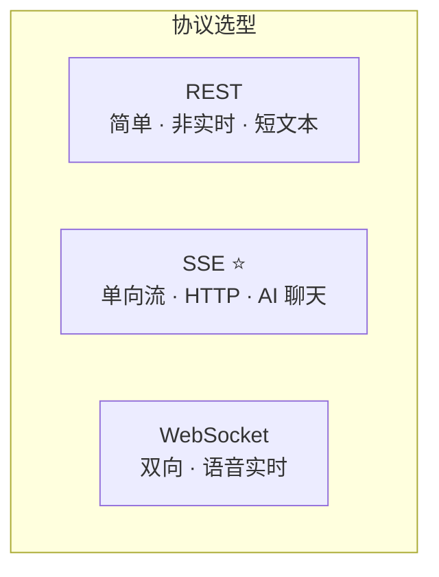

### Agent vs Chatbot

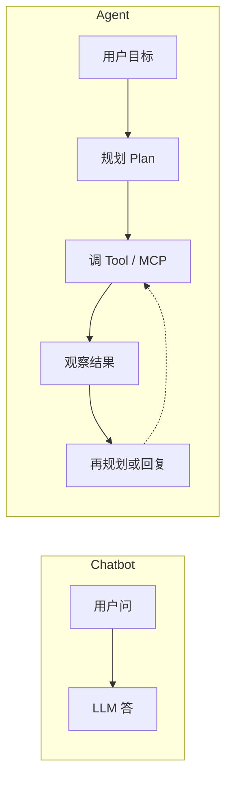

### MCP 在架构中的位置

```mermaid
flowchart TB
    LLM["大模型"] <-->|MCP 协议| MCP["MCP Server"]
    MCP --> IDE["IDE / 代码库"]
    MCP --> BR["浏览器"]
    MCP --> KB["企业知识库"]
    MCP --> DB["数据库"]
```

| 问题 | 一句话回答 |
|------|------------|
| SSE 和 WebSocket 区别？ | SSE 单向流、HTTP 兼容；WS 双向、适合实时语音 |
| 为什么需要 AI Gateway？ | 鉴权、计费、路由、安全、统一多家模型 |
| Embedding 和 LLM 区别？ | Embedding 把文本变向量做相似度；LLM 做生成 |
| Temperature 作用？ | 越高越随机创意；越低越确定，事实问答用低值 |
| Top-p / Top-k？ | 采样策略，控制生成多样性 |
| Agent 和 Chatbot 区别？ | Agent 能规划、调工具、多步执行；Chatbot  mainly 对话 |
| MCP 是什么？ | Model Context Protocol，统一模型与外部工具/数据连接 |
| 向量库为什么不用 MySQL？ | 需要高维向量相似度检索，专用库有 ANN 索引 |
| 如何评测 RAG 质量？ | 检索 Recall、答案 Faithfulness、人工满意度 |
| Kotlin Flow vs RxJava？ | Flow 更轻、与 Coroutine 一体；背压天然支持 |

---

## 六、算法与手写题（AI 岗也会考基础）

Android AI 岗 **算法难度通常低于纯算法岗**，但基础题仍可能出现：

| 类型 | 例题 |
|------|------|
| 字符串 | 最长无重复子串、有效括号 |
| 链表 | 反转链表、合并两个有序链表 |
| 树 | 二叉树最大深度、判断子树 |
| 双指针 | 三数之和、移动零 |
| 设计题 | LRU Cache（聊天历史缓存场景） |
| 场景题 | 实现一个简单的 Token 合并刷新逻辑（伪代码） |

**结合 AI 的场景题：**

- 设计支持 `O(1)` get/put 的 Prompt 缓存
- 多路 SSE 流合并优先级队列
- 滑动窗口统计最近 N 轮对话 Token 总数

---

## 七、Android AI 岗位必备技术栈

### Android

- Kotlin、Coroutines、Flow、StateFlow / SharedFlow
- Jetpack Compose（或 RecyclerView + DiffUtil）
- Room、Paging3、WorkManager
- OkHttp（SSE / WebSocket）、Retrofit
- 性能：Systrace、LeakCanary、主线程监控

### AI / LLM

- OpenAI API、DeepSeek、Qwen、Gemini、Claude
- Prompt Engineering、Function Calling、Structured Output
- RAG：Embedding、Chunking、Rerank、向量库
- 评测：幻觉检测、RAG 指标
- 了解：MCP、Agent 框架、多模态（图生文）

### RAG 基础设施

- Milvus、Chroma、Elasticsearch（Hybrid）
- Embedding：bge-m3、OpenAI embedding

### 服务端（加分）

- Spring Boot / FastAPI 做 AI Gateway
- Redis 缓存、消息队列异步 ingest

---

## 八、面试前 checklist

- [ ] 能白板画：SSE 流式架构、RAG 链路、Function Calling 流程
- [ ] 能讲清：TTFT 优化做过什么、Token 怎么省
- [ ] 准备 1 个失败案例：如幻觉没解决好，后来怎么改
- [ ] 准备反问：团队 AI 基建程度、评测体系、端侧 AI 规划

---

## 九、面试总结

**考察维度总览：**

```mermaid
mindmap
  root((Android AI 面试))
    LLM 基础
      API 接入
      流式 SSE
      Token 成本
    RAG
      Chunking
      Hybrid Search
      Rerank
    Prompt
      结构设计
      安全边界
    Android 工程
      StateFlow 架构
      防卡顿
      Room 存储
    系统设计
      Chat App
      AI Gateway
    安全合规
      Prompt Injection
      内容过滤
```

AI 应用开发岗位重点考察：

1. **LLM 基础** — API、参数、流式、成本
2. **RAG** — 全链路、Chunk、检索优化
3. **Prompt Engineering** — 结构、边界、安全
4. **Android 流式架构** — Flow、防卡顿、存储
5. **性能优化** — TTFT、UI 刷新、内存
6. **系统设计** — Chat App、RAG、网关
7. **成本控制** — Token、模型路由、缓存
8. **AI 安全** — 注入、过滤、合规

牢记一句话：

> **「AI 只是能力，工程化才是竞争力。」**

---

## 附录：推荐复习资源

- [Android 核心面试题汇总](https://juejin.cn/post/7267737437953720359)
- OpenAI / DeepSeek 官方文档：Streaming、Function Calling
- LangChain / LlamaIndex 文档：RAG 最佳实践
- 论文速览：RAG、Lost in the Middle、ReAct Agent
